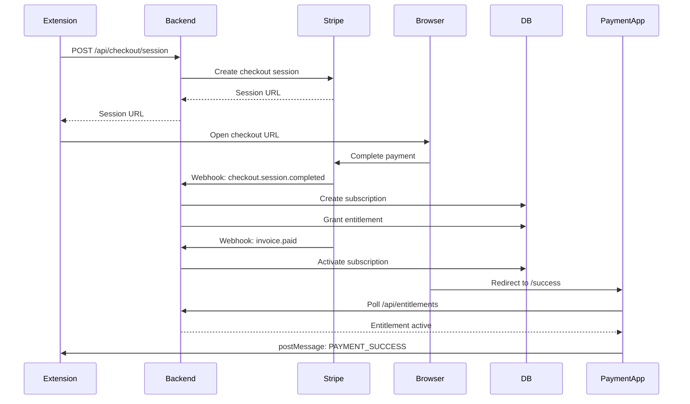
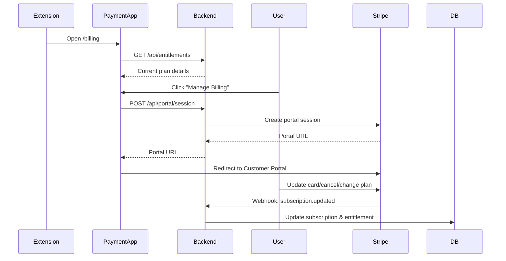
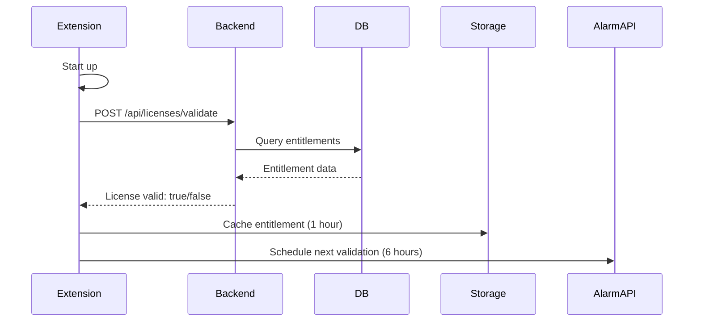

# Uswift Payment System

A production-grade, MV3-compliant payment system for the Uswift Chrome Extension.

## 🏗️ Architecture

```
┌─────────────────────────────────────────────────────────────┐
│                  Chrome Extension (MV3)                      │
│  ┌──────────────────────────────────────────────────────┐   │
│  │  PaymentService (src/services/PaymentService.ts)     │   │
│  │  - Opens hosted Stripe Checkout                      │   │
│  │  - Manages entitlement cache                         │   │
│  │  - Validates license                                 │   │
│  └──────────────────────────────────────────────────────┘   │
└─────────────────────────────────────────────────────────────┘
                            │
                            │ HTTPS/JSON API
                            ▼
┌─────────────────────────────────────────────────────────────┐
│              Payment Backend (Node/TypeScript)               │
│  ┌────────────────────────────────────────────────────┐     │
│  │  API Routes                                        │     │
│  │  - /api/checkout/session                           │     │
│  │  - /api/portal/session                             │     │
│  │  - /api/entitlements                               │     │
│  │  - /api/licenses/validate                          │     │
│  │  - /webhooks/stripe                                │     │
│  └────────────────────────────────────────────────────┘     │
│  ┌────────────────────────────────────────────────────┐     │
│  │  Payment Gateway Abstraction                       │     │
│  │  - StripeGateway (implemented)                     │     │
│  │  - PayPalGateway (stub)                            │     │
│  │  - BraintreeGateway (stub)                         │     │
│  │  - AdyenGateway (stub)                             │     │
│  └────────────────────────────────────────────────────┘     │
│  ┌────────────────────────────────────────────────────┐     │
│  │  Webhook Handler (Idempotent)                      │     │
│  │  - Processes Stripe events                         │     │
│  │  - Updates subscriptions                           │     │
│  │  - Grants/revokes entitlements                     │     │
│  └────────────────────────────────────────────────────┘     │
│  ┌────────────────────────────────────────────────────┐     │
│  │  Entitlement Service (Source of Truth)             │     │
│  │  - Manages feature access                          │     │
│  │  - Validates licenses                              │     │
│  └────────────────────────────────────────────────────┘     │
└─────────────────────────────────────────────────────────────┘
                            │
                            │ Stripe SDK
                            ▼
                    ┌──────────────┐
                    │    Stripe    │
                    │     API      │
                    └──────────────┘
                            │
                            │ Webhooks
                            ▼
┌─────────────────────────────────────────────────────────────┐
│              Payment Web App (React)                         │
│  - /success (activation polling)                             │
│  - /cancel (payment canceled)                                │
│  - /billing (manage subscription)                            │
│  - /checkout (Payment Element - optional)                    │
└─────────────────────────────────────────────────────────────┘
                            │
                            │ PostgreSQL
                            ▼
┌─────────────────────────────────────────────────────────────┐
│                      Database                                │
│  - users, products, prices                                   │
│  - subscriptions, payments                                   │
│  - entitlements (source of truth)                            │
│  - webhook_events (idempotency)                              │
│  - refunds, disputes, audit_logs                             │
└─────────────────────────────────────────────────────────────┘
```

## 🚀 Setup Instructions

### 1. Prerequisites

- Node.js 18+
- PostgreSQL 14+
- Stripe account
- Domain for payment web app (e.g., pay.uswift.app)

### 2. Database Setup

```bash
# Create database
createdb uswift_payments

# Run migrations
psql uswift_payments < payment-backend/migrations/001_initial_schema.sql

# Seed data (update Stripe IDs first!)
psql uswift_payments < payment-backend/migrations/seed.sql
```

### 3. Stripe Setup

1. **Create Products in Stripe Dashboard:**
   - Go to https://dashboard.stripe.com/products
   - Create "Uswift Pro" product
   - Add two prices: Monthly ($9.99) and Annual ($99)
   - Note the Price IDs (e.g., `price_xxxxxxxxxxxxx`)

2. **Set up Webhooks:**
   - Go to https://dashboard.stripe.com/webhooks
   - Add endpoint: `https://your-backend.com/webhooks/stripe`
   - Select events:
     - `checkout.session.completed`
     - `invoice.paid`
     - `invoice.payment_failed`
     - `customer.subscription.created`
     - `customer.subscription.updated`
     - `customer.subscription.deleted`
     - `charge.refunded`
     - `charge.dispute.created`
     - `charge.dispute.closed`
   - Note the Webhook Secret (e.g., `whsec_xxxxxxxxxxxxx`)

3. **Enable Stripe Tax** (optional):
   - Go to https://dashboard.stripe.com/settings/tax
   - Enable automatic tax calculation

4. **Create Promo Codes** (optional):
   - Go to https://dashboard.stripe.com/coupons
   - Create promotional codes

### 4. Backend Configuration

```bash
cd payment-backend

# Install dependencies
npm install

# Create .env file
cp .env.example .env

# Edit .env with your values:
# - STRIPE_SECRET_KEY=sk_test_...
# - STRIPE_WEBHOOK_SECRET=whsec_...
# - DATABASE_URL=postgresql://...
# - JWT_SECRET=your-256-bit-secret
# - EXTENSION_TOKEN_SECRET=your-extension-secret
# - PRICE_PRO_MONTHLY=price_xxxxxxxxxxxxx
# - PRICE_PRO_ANNUAL=price_xxxxxxxxxxxxx

# Start development server
npm run dev

# Test webhook locally with Stripe CLI
stripe listen --forward-to localhost:3000/webhooks/stripe
```

### 5. Payment Web App Configuration

```bash
cd payment-webapp

# Install dependencies
npm install

# Create .env file
cp .env.example .env

# Edit .env:
# - VITE_API_URL=http://localhost:3000
# - VITE_STRIPE_PUBLISHABLE_KEY=pk_test_...

# Start development server
npm run dev

# Build for production
npm run build
```

### 6. Chrome Extension Configuration

Update `extension/.env`:

```env
# Add payment-related variables
VITE_BACKEND_API_URL=https://your-backend.com
VITE_PRICE_PRO_MONTHLY=price_xxxxxxxxxxxxx
VITE_PRICE_PRO_ANNUAL=price_xxxxxxxxxxxxx
VITE_FEATURE_FREE_TRIAL=true
```

Update `extension/src/Popup.tsx` to include PaymentSettings component:

```tsx
import PaymentSettings from './PaymentSettings';

// Add to your navigation/settings page:
<PaymentSettings />
```

## 📋 API Documentation

### Checkout API

**POST /api/checkout/session**

Create a Stripe Checkout session.

Request:
```json
{
  "userId": "uuid",
  "priceId": "price_xxxxx",
  "mode": "subscription",
  "successUrl": "https://pay.uswift.app/success",
  "cancelUrl": "https://pay.uswift.app/cancel",
  "promoCode": "WELCOME20",
  "trialPeriodDays": 14
}
```

Response:
```json
{
  "success": true,
  "url": "https://checkout.stripe.com/...",
  "sessionId": "cs_test_..."
}
```

### Entitlements API

**GET /api/entitlements**

Get current user's entitlements.

Headers:
```
Authorization: Bearer <jwt_token>
```

Response:
```json
{
  "plan": "pro",
  "status": "active",
  "currentPeriodEnd": "2024-12-31T23:59:59Z",
  "features": [
    "auto_apply",
    "ai_resume",
    "ai_cover_letter",
    "priority_support",
    "unlimited_applies"
  ]
}
```

### License Validation API

**POST /api/licenses/validate**

Validate user's license (called by extension).

Headers:
```
Authorization: Bearer <extension_token>
```

Request:
```json
{
  "userId": "uuid"
}
```

Response:
```json
{
  "valid": true,
  "plan": "pro",
  "expiresAt": "2024-12-31T23:59:59Z"
}
```

### Admin API

**POST /api/admin/refunds**

Issue a refund (requires admin API key).

Headers:
```
X-Admin-API-Key: your-admin-api-key
```

Request:
```json
{
  "paymentId": "pi_xxxxx",
  "amount": 999,
  "reason": "requested_by_customer"
}
```

## 🔐 Security

### MV3 Compliance

✅ **No remote code execution**: Extension never loads `https://js.stripe.com`
✅ **Hosted payment pages**: All payment UI on separate domain
✅ **CSP compliant**: No inline scripts, all Stripe JS on payment domain
✅ **No secrets in extension**: All keys live in backend environment

### PCI Compliance

✅ **SAQ A eligible**: Card data never touches our servers
✅ **Stripe handles cards**: All sensitive data goes directly to Stripe
✅ **HTTPS only**: All API communication over TLS
✅ **Webhook verification**: All webhooks verified with HMAC signature

### Authentication

- **JWT tokens** for web app authentication
- **Extension tokens** for extension-to-backend communication (separate secret)
- **Admin API key** for admin operations
- **Stripe webhook secret** for webhook verification

## 🎯 User Flows

### 1. New Subscription



### 2. Manage Billing



### 3. License Validation (Extension Startup)



## 🧪 Testing

### Unit Tests

```bash
cd payment-backend
npm test
```

### Integration Tests

```bash
# Test checkout flow
npm run test:integration

# Test webhook idempotency
npm run test:webhooks
```

### Stripe CLI Testing

```bash
# Listen to webhooks locally
stripe listen --forward-to localhost:3000/webhooks/stripe

# Trigger test events
stripe trigger checkout.session.completed
stripe trigger invoice.paid
stripe trigger customer.subscription.deleted
```

### Manual Testing Checklist

- [ ] New subscription (monthly)
- [ ] New subscription (annual)
- [ ] Subscription update (monthly→annual)
- [ ] Subscription cancellation
- [ ] Payment failure
- [ ] Refund
- [ ] Dispute
- [ ] Extension license validation
- [ ] Entitlement caching
- [ ] Webhook idempotency (send same event twice)

## 📊 Observability

### Logs

Logs are written to:
- Console (development)
- `logs/combined.log` (production)
- `logs/error.log` (errors only)

Structured JSON format with correlation IDs:
```json
{
  "timestamp": "2024-01-15T10:30:45Z",
  "level": "info",
  "message": "Checkout session created",
  "correlationId": "abc123",
  "userId": "user-uuid",
  "sessionId": "cs_test_xxx"
}
```

### Metrics

Available at `/api/admin/stats`:
- Active subscriptions
- Active entitlements
- MRR (Monthly Recurring Revenue)
- Failed payments (last 7 days)
- Churn rate (last 30 days)

### Alerts

Set up monitoring for:
- Non-2xx responses on `/webhooks/stripe`
- Failed webhook processing (status=failed in webhook_events)
- Payment failure rate > 5%
- Subscription cancellation rate > 10%

## 🚢 Deployment

### Backend Deployment

```bash
# Build
cd payment-backend
npm run build

# Deploy to your platform (examples):
# - Heroku: git push heroku main
# - Railway: railway up
# - Vercel: vercel deploy
# - AWS: docker build and push to ECS
```

Environment variables to set:
- `NODE_ENV=production`
- `DATABASE_URL=postgresql://...`
- `STRIPE_SECRET_KEY=sk_live_...`
- `STRIPE_WEBHOOK_SECRET=whsec_...`
- `JWT_SECRET=...`
- `ADMIN_API_KEY=...`

### Payment Web App Deployment

```bash
# Build
cd payment-webapp
npm run build

# Deploy to Vercel/Netlify/Cloudflare Pages
vercel deploy
```

Update environment variables:
- `VITE_API_URL=https://api.uswift.app`
- `VITE_STRIPE_PUBLISHABLE_KEY=pk_live_...`

### Database Migration

```bash
# Run migrations on production
psql $DATABASE_URL < migrations/001_initial_schema.sql

# Run seed (with production Stripe IDs)
psql $DATABASE_URL < migrations/seed.sql
```

### Webhook Registration

1. Update Stripe webhook endpoint to production URL
2. Update webhook secret in backend environment variables
3. Test with Stripe Dashboard "Send test webhook"

## 🔧 Maintenance

### Adding New Payment Method

1. Implement gateway in `src/gateways/NewGateway.ts`
2. Extend `PaymentGateway` abstract class
3. Register in `src/index.ts`:
   ```ts
   const newGateway = new NewGateway(...);
   PaymentGatewayFactory.register('new', newGateway);
   ```
4. Add webhook route in `src/routes/webhooks.ts`
5. Update feature flag: `FEATURE_SECONDARY_GATEWAY=true`

### Handling Disputes

1. Monitor `/api/admin/webhook-events?status=failed`
2. Check `disputes` table for new disputes
3. Upload evidence via Stripe Dashboard
4. Monitor `charge.dispute.updated` events

### Data Export (GDPR/CCPA)

```sql
-- Export user data
SELECT * FROM users WHERE id = 'user-uuid';
SELECT * FROM entitlements WHERE user_id = 'user-uuid';
SELECT * FROM subscriptions WHERE user_id = 'user-uuid';
SELECT * FROM payments WHERE user_id = 'user-uuid';
```

### Data Deletion (GDPR Right to be Forgotten)

```sql
-- Delete user data (cascades to related tables)
DELETE FROM users WHERE id = 'user-uuid';
```

## 📚 Additional Resources

- [Stripe API Documentation](https://stripe.com/docs/api)
- [Chrome Extension Manifest V3](https://developer.chrome.com/docs/extensions/mv3/intro/)
- [PCI SAQ A Requirements](https://www.pcisecuritystandards.org/documents/SAQ_A_v4.pdf)
- [PostgreSQL Documentation](https://www.postgresql.org/docs/)

## 🆘 Support

For issues or questions:
- Check logs: `payment-backend/logs/`
- Review webhook events: `/api/admin/webhook-events`
- Test webhooks: `stripe trigger <event_name>`
- Contact: support@uswift.app

## 📝 License

Proprietary - All rights reserved
